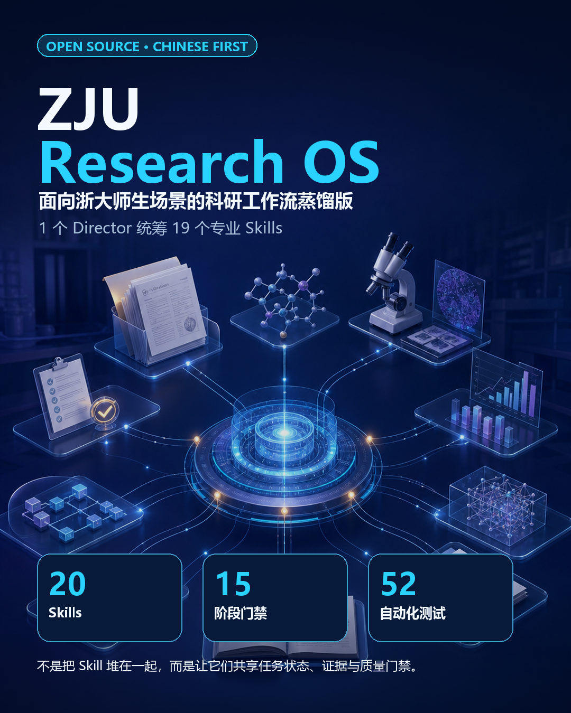
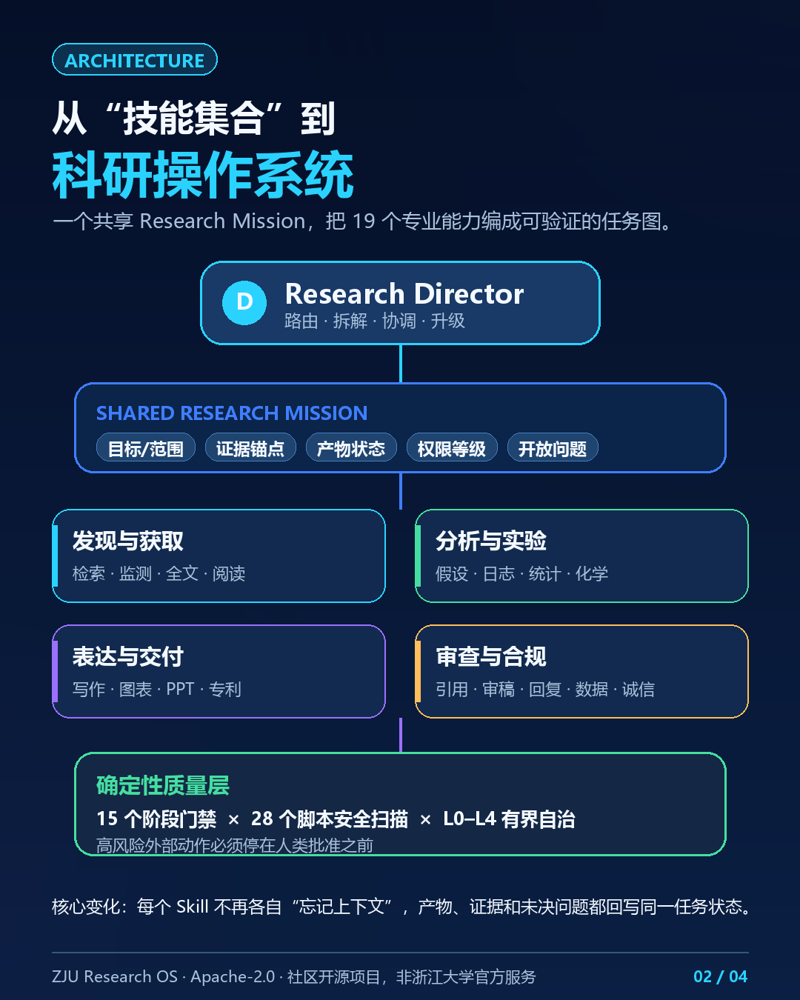
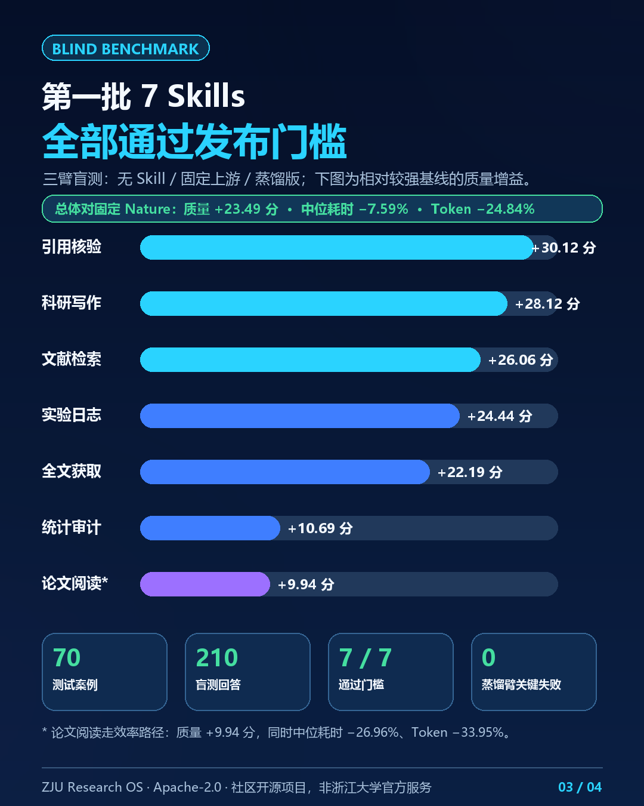
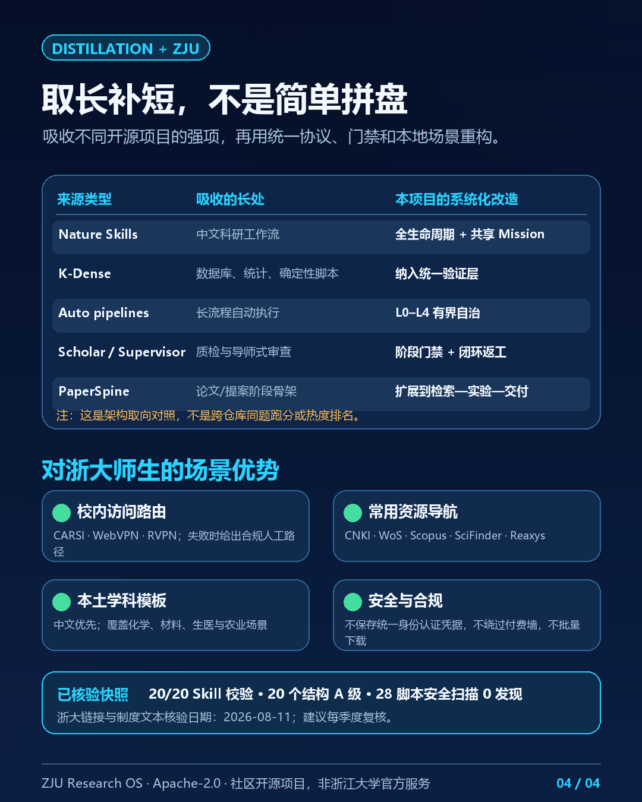

# ZJU Research OS

> 面向浙江大学科研场景的中文优先、证据可追溯 Research OS：由 1 个 Research Director 协调 19 个专业 Skills，把检索、阅读、实验、统计、写作、评审与共享连接成可暂停、可审计、可继续的 Research Mission。



当前版本为 **v0.4.0 Beta**。这是社区开源项目，不是浙江大学官方产品或服务。

## 它解决什么问题

许多科研 Skills 擅长单点任务，但跨阶段使用时容易丢失来源、假设、失败结果和人工审批状态。ZJU Research OS 没有把所有能力塞进一个超长提示词，而是采用“**Director + Specialists**”架构：

- Research Director 把目标转成带依赖关系、预算、风险和停止条件的 Research Mission；
- 19 个专业 Skill 分别完成检索、全文获取、引用审计、精读、证据综合、实验记录、统计、写作、制图、答审等任务；
- Evidence、Claim、Artifact、Decision、Risk 和 Open Loop 使用稳定 ID 跨阶段传递；
- 每个阶段经过证据、数据、统计、完整性、复现性或发布闸门后才可继续；
- 自治上限分为 L0–L4。默认只在本地、安全边界内工作，凭据、外部写入、伦理、专利与投稿始终保留人工闸门。



## 能力与状态

| 层级 | Skills | 当前状态 | 已有证据 |
|---|---|---:|---|
| 统一入口 | [`zju-research-director`](skills/zju-research-director/) | Beta | 20/20 跨领域路由案例；3/3 新上下文前向测试 |
| 文献入口闭环 | [`literature-search`](skills/zju-literature-search/)、[`fulltext-access`](skills/zju-fulltext-access/)、[`reference-audit`](skills/zju-reference-audit/)、[`paper-reader`](skills/zju-paper-reader/) | Stable | 70 案例、210 份回答的三臂盲测 |
| 实验到论文 | [`experiment-log`](skills/zju-experiment-log/)、[`statistics-audit`](skills/zju-statistics-audit/)、[`scientific-writing`](skills/zju-scientific-writing/) | Stable | 同一三臂盲测，7/7 通过发布门槛 |
| 证据与研究设计 | [`literature-monitor`](skills/zju-literature-monitor/)、[`evidence-synthesis`](skills/zju-evidence-synthesis/)、[`hypothesis-design`](skills/zju-hypothesis-design/) | Beta | 每项 10 个任务级金标准案例 |
| 交流与同行评审 | [`scientific-figure`](skills/zju-scientific-figure/)、[`paper2ppt`](skills/zju-paper2ppt/)、[`reviewer`](skills/zju-reviewer/)、[`review-response`](skills/zju-review-response/) | Beta | 每项 10 个任务级金标准案例 |
| 共享、立项与转化 | [`data-availability`](skills/zju-data-availability/)、[`proposal-writer`](skills/zju-proposal-writer/)、[`paper-to-patent`](skills/zju-paper-to-patent/) | Beta | 每项 10 个任务级金标准案例 |
| 专业数据库与治理 | [`chemistry-databases`](skills/zju-chemistry-databases/)、[`research-integrity`](skills/zju-research-integrity/) | Beta | 每项 10 个任务级金标准案例 |

## 量化结果



### 首批 7 项：正式三臂盲测

在相同模型设置下运行 70 个案例，每个案例分别使用“无 Skill”“固定版本 Nature Skills 上游 Skill”“ZJU 蒸馏版”，共得到 210 份回答，再由盲评员评分并处理分歧。

| 评测臂 | 平均质量分（0–100） | 单任务中位耗时 | 单任务 Token 中位数 | 关键失败 |
|---|---:|---:|---:|---:|
| 无 Skill | 56.759 | 31.377 秒 | 34,091 | 3/70 |
| 固定 Nature 上游 | 61.714 | 61.924 秒 | 96,989 | 4/70 |
| ZJU 蒸馏版 | **85.205** | **57.224 秒** | **72,893.5** | **0/70** |

ZJU 蒸馏版相对固定 Nature 上游平均质量高 **23.491 分**，同时中位耗时降低 **7.59%**、Token 降低 **24.84%**；相对无 Skill 平均质量高 **28.446 分**。无 Skill 的确更快、更省 Token，但质量明显较低，且出现 3 次关键失败。逐项与“无 Skill / 上游 Skill 中质量更高者”相比：

| Skill | 质量提升（百分点） | 发布路径 |
|---|---:|---|
| Literature Search | +26.063 | 质量 |
| Full-text Access | +22.187 | 质量 |
| Reference Audit | +30.124 | 质量；同时耗时下降 16.809%、Token 下降 41.991% |
| Paper Reader | +9.938 | 效率；耗时下降 26.958%、Token 下降 33.950% |
| Experiment Log | +24.437 | 质量 |
| Statistics Audit | +10.687 | 质量 |
| Scientific Writing | +28.125 | 质量 |

### 扩展能力与 Director

| 范围 | 案例 | 结果 | 证据边界 |
|---|---:|---|---|
| 12 个扩展 Skills | 120 | 平均 84.385/100；金标准检查命中率 84.58%；严重失败 0；12/12 通过 | 任务级内部评测，不是与其他仓库的对照试验 |
| Director 路由 | 20 | 5 个领域、覆盖 19 个专业 Skills，20/20 通过，严重失败 0 | 确定性路由基准，不是模型质量盲测 |
| Director 新上下文测试 | 3 | 3/3 通过，严重失败 0 | 前向压力测试，不是跨项目 head-to-head |
| 本地工程验证 | — | 20/20 格式校验；20 项结构审计为 A；52 个单元测试通过；28 个脚本规则扫描零发现 | 规则范围内的工程检查，不等于形式化安全证明 |

原始结果见 [`provenance/release-status.yaml`](provenance/release-status.yaml)、[`evals/results/full-20260811-a/aggregate-adjudicated.json`](evals/results/full-20260811-a/aggregate-adjudicated.json)、[`evals/results/expansion-full-20260811-a/aggregate-expansion-full-judge-1.json`](evals/results/expansion-full-20260811-a/aggregate-expansion-full-judge-1.json) 和 [`evals/results/director-forward-20260811-a.json`](evals/results/director-forward-20260811-a.json)。

评测生成模型为 GPT-5.4-mini，评分模型为 GPT-5.5；首批采用双盲评审并对分歧案例裁决。所有数字均是 2026-08-11 固定快照的仓库内结果，不应外推为所有模型、学科或真实场景的保证。

## 与其他科研 Skills 的区别

这不是排行榜。下表说明本项目从各开源项目吸收了什么，以及进一步做了什么；除首批 7 项与固定 Nature Skills 上游的三臂盲测外，**没有**宣称对其他项目取得 head-to-head 优势。



| 参考项目 | 借鉴的长处 | ZJU Research OS 的进一步取舍 | 比较证据 |
|---|---|---|---|
| [Nature Skills](https://github.com/Yuan1z0825/nature-skills) | 中文科研流程、写作、获取、图表、答审等主骨架 | 新增共享 Research Mission、Director 路由、跨阶段状态与显式人类闸门；压缩营销和安装上下文 | 首批 7 项有固定 commit 三臂盲测 |
| [K-Dense Scientific Agent Skills](https://github.com/K-Dense-AI/scientific-agent-skills) | 数据库广度、统计、引用管理、确定性脚本 | 将这些模式放进中文优先、依赖最小化、可追溯的 ZJU 工作流，并限制网络行为 | 架构与功能对照，无 head-to-head |
| [Auto-claude-code-research-in-sleep](https://github.com/wanshuiyin/Auto-claude-code-research-in-sleep) | 自动科研流水线、实验交接、来源与评审闸门 | 采用 L0–L4 有界自治、预算/停止条件和外部操作人工闸门，不默认无人值守写入 | 架构与安全边界对照 |
| [Claude Scholar](https://github.com/Galaxy-Dawn/claude-scholar) | Skill 质量评分、渐进披露、整改清单 | 把质量治理落到全仓库结构审计、单测、安全扫描与分级发布状态 | 工程检查；无模型对照 |
| [PaperSpine](https://github.com/WUBING2023/PaperSpine) | 贡献契约、结果验证、审稿异议与阶段恢复 | 从论文流程扩展到检索—实验—分析—投稿—共享—专利，同时保持专业 Skill 可独立调用 | 能力覆盖对照 |
| [Agentic Awesome Skills](https://github.com/sickn33/agentic-awesome-skills) 等 | 能力目录、选择清单、流水线与导师式审查 | 只蒸馏与科研闭环相关且许可证兼容的模式；`academic-research-skills` 与 `Supervisor-Skills` 因许可边界仅检查、不改编 | 来源与采用范围审计 |

完整来源、固定 commit、许可证与采用范围见 [`provenance/sources.yaml`](provenance/sources.yaml) 和 [`NOTICE`](NOTICE)。

## 对浙大师生的具体优势

- **校外访问路径本地化**：按浙江大学图书馆当前页面在 WebVPN、CARSI、RVPN 与人工馆员路径之间路由；候选数据库包括 CNKI、Web of Science、Scopus、SciFinder 和 Reaxys，但每次以图书馆实时可用性为准。
- **中文科研语境**：中文输入、中文或双语交付，并覆盖化学、材料、生医、农业和通用/计算科研模板。
- **合规边界写进工作流**：不保存统一身份认证密码、Cookie 或 Token，不绕过付费墙，不做违规批量下载；涉及伦理、隐私、专利、外部提交时停止并请求相应人工审核。
- **校内规范可追溯**：访问与科研诚信路由引用浙江大学权威页面，并记录核验日期；制度文本计划按季度复核。
- **不覆盖现有工具**：可以保留已有 `nature-*` Skills，在项目范围内并行试用和对照。

权威入口：[浙江大学图书馆校外访问](https://libweb.zju.edu.cn/56334/list.htm) · [电子资源使用管理办法](https://libweb.zju.edu.cn/2016/1014/c55987a2245977/page.htm) · [学术道德行为规范及管理办法](https://pi.zju.edu.cn/2019/0920/c66998a2550400/page.htm)

## 快速使用

将仓库根目录作为本地 Codex 插件加载；插件入口为 [`.codex-plugin/plugin.json`](.codex-plugin/plugin.json)，开放格式 Skills 位于 [`skills/`](skills/)。具体安装命令以所用 Codex / Agent Skills 客户端版本为准。

跨阶段任务从 Director 开始：

```text
请使用 zju-research-director，把“钙钛矿器件湿热稳定性”规划成一项 Research Mission。
自治上限 L2；先完成可复现检索、证据综合和可证伪假设，只执行下一个就绪阶段，不做外部提交。
```

单点任务直接调用专业 Skill：

```text
请使用 zju-reference-audit，逐字段核验这 30 条参考文献，并分开判断“书目信息正确”和“是否支持正文主张”。
```

继续已有项目：

```text
请使用 zju-research-director 验证现有 research-mission.json，保留所有 open_loops 和失败实验，从第一个 ready 步骤继续。
```

## 安全、许可证与发布状态

- 本项目代码与原创工作流按 [Apache-2.0](LICENSE) 发布；第三方归属见 [`NOTICE`](NOTICE)。
- 非商业或 Share-Alike 来源只用于能力比较，未把其文本、模板或工作流表达并入本发行包。
- Star 数用于发现候选项目，不作为科学正确性或安全性的证据。
- 7 个首批 Skills 为 Stable；12 个扩展 Skills 与 Director 为 Beta。Director 在完成强编排基线盲测或等价的长期独立验证前不会升级为 Stable。

评测是固定模型、固定案例和固定日期的仓库内证据，不代表所有模型、学科或真实科研场景。欢迎提交可复现案例、失败样本和改进建议。
\n