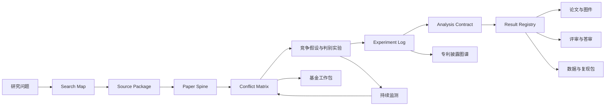

# ZJU Research OS

一套面向浙江大学科研场景的中文科研 Skills。项目由 1 个 Research Director 和 19 个专业 Skills 组成，覆盖文献检索、论文阅读、证据综合、实验记录、统计分析、写作、制图、答审、数据共享和科研转化。


项目当前版本是 **v0.7.0-beta.1**，20 个 Skills 都处于 Beta 阶段。这是社区开源项目，与浙江大学官方无关。

## 为什么做这个项目

做这个项目的起点很简单：单独完成一次检索、润色一段文字，现有科研 Skills 往往已经够用；真正麻烦的是把一项研究连续做下去。

文献检索得到的来源，到了写作时可能已经找不到对应关系；实验设计里的实验单位和重复方式，进入统计阶段后又要重新解释；同一个结果分别写进正文、图注和答审信，很容易出现数字或措辞不一致。任务一长，聊天记录也很难承担完整的项目状态。

因此，这个项目没有把所有功能写进一份很长的提示词，而是采用 Director + Specialists 的结构：

- Research Director 负责拆解任务、安排依赖关系，并记录项目进度；
- 19 个专业 Skill 分别处理检索、全文获取、引用核验、精读、实验、统计、写作等具体工作；
- 文献、证据、主张、分析结果和产物都有稳定 ID，方便在不同阶段继续引用；
- 研究可以暂停和恢复，失败实验、矛盾证据与未解决问题不会因为切换 Skill 而被丢掉；
- 涉及账号、伦理、专利、外部上传或投稿时，仍然交给有权限的人确认。


## v0.7：把 20 个 Skills 放进同一套评测

此前的数字并不在同一条线上：最早的三臂对照只覆盖 7 个核心 Skills，后续 12 个扩展 Skills 跑的是整改后的单臂开发集，Director 测的是路由。这些结果可以帮助开发，却不能合并成“20 项总分”。v0.7 先把这个口径问题解决了。

- 建立覆盖 20/20 Skills 的能力矩阵，每项固定 5 个核心能力，避免只测试容易通过的部分。
- 评测拆成四层：L1 工程契约、L2 确定性功能、L3 已知开发任务三臂对照、L4 冻结留出任务三臂盲测。每项至少 53 个检查/案例单位；完整组合至少 1,060 个单位、2,140 条臂级记录。
- L2 报 Wilson 95% 区间，L3/L4 按案例配对 bootstrap；ZJU 版本与“无 Skill / 最强开源基线中较好者”比较，不能用较弱对照抬高增益。
- 正式分数必须绑定 Skill commit、协议、能力矩阵、案例、回答、评分、基线预选和盲法分配。评分器会重新计算维度分与裁决结果，并拒绝跨臂复用回答。
- 独立发布门使用预登记的 Ed25519 公钥验证冻结留出、首次作答和揭盲材料。仓库当前没有登记公钥，因此任何自报记录都不能把项目升级为 Stable。
- 已完成 L1 全量普查：20 项 × 6 个必检点，共 **120/120** 通过；输入清单绑定 **153** 个文件。这个结果只代表工程完备度，不是科研能力分。

当前 `official_portfolio_score` 仍为 `null`。这是有意的：L2–L4，尤其是独立管理的冻结留出集，还没有全部执行。把版本号直接改成正式版会超出证据，所以本轮继续保留 Beta。协议、能力矩阵和当前状态分别见 [`evals/portfolio-protocol-v3.md`](evals/portfolio-protocol-v3.md)、[`evals/skill-evaluation-matrix-v3.json`](evals/skill-evaluation-matrix-v3.json) 与 [`provenance/evaluation-status-v3.yaml`](provenance/evaluation-status-v3.yaml)。

这一轮也继续补了三处实际能力：Evidence Synthesis 增加显式模型选择的效应量汇总（REML / DerSimonian–Laird、Hartung–Knapp、预测区间与小样本/异质性警告）；Data Availability 分开判断“本地文件包完整”和“标识符/许可证已核验、可公开发布”；Hypothesis Design 的实验组合选择加入成本单位、依赖、互斥、必选、可行性和伦理资格约束。

## v0.6：从工作流走向可执行闭环

v0.5 把检索、实验、统计、写作和交付的契约接了起来；v0.6 继续补最实际的一层——让几条核心链可以直接处理真实文件，而不只给出步骤和检查表。

- 文献导入现在可以直接读取 JSON/JSONL、CSV/TSV、RIS、BibTeX 和 PubMed NBIB，并进入同一套 DOI/PMID/题名去重与稳定 ID 流程。
- Paper Reader 新增离线源准备器。它会从真实 PDF 或 UTF-8 文本提取逐页内容，记录文件哈希、页码锚点、章节、图表/公式提及、覆盖率和可能需要 OCR 的页面，再交给 Paper Card 或双语精读。
- Statistics 不再只有审计。对于已经冻结的简单分析契约，可以直接运行 Welch t 检验、配对 t 检验、Pearson 相关和一元 OLS；结果会写入原有 Result Registry，并绑定数据、契约、代码和软件版本。
- Scientific Figure 可以从源数据与已核验的 `result_id` 生成真实 PNG、SVG 和 PDF。首批覆盖组间原始点、配对连线和散点/OLS 图，导出文件与输入都会写入带哈希的 manifest。
- Director 增加了独立的执行器注册表。ZJU Skill 继续负责科研工作流，具体 PDF、统计、制图、Zotero、文献库或化学数据库能力由当前 Agent 环境按清单解析，缺失时明确返回 unresolved。
- 测试新增真实多页 PDF 和 CSV→统计→Result Registry→PNG/SVG/PDF 链，并增加 Windows/Linux、Python 3.11/3.13 的 GitHub Actions 配置。

这轮没有给项目增加新的模型跑分。新增的量化结果是确定性的工程与数值测试，不能替代盲测或专家评审。

## v0.5 主要改了什么

如果把这次更新概括成一句话，就是把原来分散的功能真正接了起来。

1. 文献检索不再停在一组关键词上。现在会从概念、机制、方法、研究对象和限制条件五个角度拆分问题，针对化学、材料、生医和农业提供不同模板，还可以沿种子论文继续追踪参考文献与后续引用，并根据新增文献比例和覆盖缺口判断是否需要继续搜索。
2. 阅读、证据综合和假设设计共用一条证据链。Paper Spine 记录论文的问题、主张、方法、证据、论证和适用边界；冲突矩阵单独保留方向相反、空结果、异质性和偏倚；候选假设则按照可证伪性、信息增益和实验区分度排序。
3. 实验记录可以直接进入统计分析。Experiment Log 2.0 会保存实验单位、观察单位、重复、随机化、层级结构、结局指标和数据谱系，Statistics Skill 再据此建立 Analysis Contract，而不是到分析阶段重新猜测实验设计。
4. 正文、图件、答审和数据说明使用同一份 Result Registry。每个结果都有 `analysis_id` 和 `result_id`，数字只登记一次，再由不同产物引用，减少手工复制带来的不一致。
5. 基金和专利不再从空白模板开始。基金 Skill 可以把证据、竞争假设和判别实验整理成目标、工作包、依赖顺序和三分支里程碑；专利 Skill 可以从论文和实验记录中整理问题—方案—效果、特征—证据、权利要求依赖和现有技术查询图谱。
6. 化学数据比较增加了条件约束。只有化合物身份、终点、单位、测量基准、实验条件、方法和证据层级能够对齐时，记录才会放在一起比较。

这次也专门检查了各个 Skill 之间的接口。文献 `record_id` 现在不会因为输入顺序变化而重新编号；Evidence 中的支持和反对关系会与逐行记录双向核对；Hypothesis 可以无损交给 Proposal 和 Experiment Log；Result Registry 也会反查 Analysis Contract。仓库里新增了一条从文献发现一直走到论文产物的集成测试。

详细改动见 [`docs/iteration-review-v0.5.md`](docs/iteration-review-v0.5.md)，评测方法见 [`docs/evaluation-methodology.md`](docs/evaluation-methodology.md)。

下面这张图展示了主要的数据交接关系：



## 包含哪些 Skills

| 范围 | Skills | 状态 | 当前测试依据 |
|---|---|---:|---|
| 统一入口 | [`zju-research-director`](skills/zju-research-director/) | Beta | 20/20 确定性路由断言；3/3 新上下文前向测试 |
| 文献入口 | [`literature-search`](skills/zju-literature-search/)、[`fulltext-access`](skills/zju-fulltext-access/)、[`reference-audit`](skills/zju-reference-audit/)、[`paper-reader`](skills/zju-paper-reader/) | Beta（legacy-v1） | v0.4 内部模型评测；Stable 晋级暂停 |
| 实验与论文 | [`experiment-log`](skills/zju-experiment-log/)、[`statistics-audit`](skills/zju-statistics-audit/)、[`scientific-writing`](skills/zju-scientific-writing/) | Beta（legacy-v1） | 同一内部评测；v3 L1 已完成，等待 L2–L4 |
| 证据与研究设计 | [`literature-monitor`](skills/zju-literature-monitor/)、[`evidence-synthesis`](skills/zju-evidence-synthesis/)、[`hypothesis-design`](skills/zju-hypothesis-design/) | Beta | 10 个开发案例/项；v3 L1 已完成，未完成冻结盲测 |
| 交流与同行评审 | [`scientific-figure`](skills/zju-scientific-figure/)、[`paper2ppt`](skills/zju-paper2ppt/)、[`reviewer`](skills/zju-reviewer/)、[`review-response`](skills/zju-review-response/) | Beta | 10 个开发案例/项；v3 L1 已完成，未完成冻结盲测 |
| 共享、立项与转化 | [`data-availability`](skills/zju-data-availability/)、[`proposal-writer`](skills/zju-proposal-writer/)、[`paper-to-patent`](skills/zju-paper-to-patent/) | Beta | 10 个开发案例/项；v3 L1 已完成，未完成冻结盲测 |
| 专业数据库与科研规范 | [`chemistry-databases`](skills/zju-chemistry-databases/)、[`research-integrity`](skills/zju-research-integrity/) | Beta | 10 个开发案例/项；v3 L1 已完成，未完成冻结盲测 |

## 测试结果，以及该怎么理解

仓库保留了 v0.4 的内部测试结果，方便后续版本对照。不过，这些数字不是第三方测评，也不能理解成科研结论的正确率。它们来自固定模型、固定案例和固定日期，应当和下面列出的限制一起看。

### 首批 7 个 Skills

2026 年 8 月 11 日，我们在固定模型设置下运行了 70 个仓库内案例。每个案例分别测试“无 Skill”“固定版本的 Nature Skills 上游 Skill”和“ZJU 版本”，共得到 210 份回答。评分时隐藏了 A/B/C 标签，由 GPT-5.5 进行两次评分；两次结果分歧时，再进行第三次裁决。这是模型评分，不是独立人类专家评分。

| 评测臂 | 平均质量分（0–100） | 单任务中位耗时 | 单任务 Token 中位数 | 关键失败 |
|---|---:|---:|---:|---:|
| 无 Skill | 56.759 | 31.377 秒 | 34,091 | 3/70 |
| 固定 Nature 上游 | 61.714 | 61.924 秒 | 96,989 | 4/70 |
| ZJU 版本 | **85.205** | **57.224 秒** | **72,893.5** | **0/70** |

按照当时使用的 legacy-v1 rubric，ZJU 版本比固定 Nature 上游平均高 **23.491 分**，中位耗时低 **7.59%**，Token 中位数低 **24.84%**；比无 Skill 平均高 **28.446 分**。这些数字是内部加权分和运行观察值，不是准确率，也不能当作因果结论。尤其是当时的工具协议没有由执行器严格强制，效率数据只能作为参考。

各项结果如下：

| Skill | 相对“无 Skill / 上游 Skill 中较高者”的内部分差 | 当时的通过方式 |
|---|---:|---|
| Literature Search | +26.063 | 质量 |
| Full-text Access | +22.187 | 质量 |
| Reference Audit | +30.124 | 质量；耗时下降 16.809%，Token 下降 41.991% |
| Paper Reader | +9.938 | 效率；耗时下降 26.958%，Token 下降 33.950% |
| Experiment Log | +24.437 | 质量 |
| Statistics Audit | +10.687 | 质量 |
| Scientific Writing | +28.125 | 质量 |

这组结果有四个已知问题：70 个案例中有 7 个参加过前期 pilot；A/B/C 的位置没有做区组均衡；日志中出现了测试配置之外的 3 次 Web 搜索和 17 次学术 MCP 调用；仓库目前只公开了聚合结果，没有完整回答、事件日志和逐条评分记录。

基于这些问题，首批 7 个 Skills 已重新标记为 Beta（legacy-v1），不再仅凭这组分数进入 Stable。后续统一比较改用 protocol v3；当前已完成全 20 项 L1 普查，但还没有可支持正式分数的 L2–L4 完整运行。

### 扩展 Skills、Director 和本地检查

| 范围 | 案例 | 结果 | 应该如何理解 |
|---|---:|---|---|
| 12 个扩展 Skills | 120 | 整改后开发集回归：平均 84.385/100；gold-check 命中率 84.58%；严重失败 0 | 最终聚合含 49 条基础运行和 71 条整改/修订记录；不是 held-out，也没有外部项目对照 |
| Director 路由 | 20 | 5 个领域，覆盖 19 个专业 Skills，20/20 路由断言通过 | 只测试路由和阶段安排，不是科研答案质量分 |
| Director 新上下文测试 | 3 | 3/3 断言通过 | 前向压力测试，不是跨项目 head-to-head |
| 本地工程检查 | — | 20/20 格式校验；L1 全量普查 120/120；186 个单元测试通过；46 个 Skill 脚本通过当前静态规则检查 | L1 和结构审计只评价工程与说明契约，不评价科学正确性；干净 CI 未下载可选上游缓存时会透明跳过 1 项缓存完整性集成检查 |
| v0.6 真实产物链 | 13 项核心执行测试 | 4 项 PDF/文本解析测试；9 项 CSV→统计→Registry→PNG/SVG/PDF 测试，覆盖组间、配对和 OLS 真图，数值与 SciPy 容差核对，并拒绝不完整多重比较家族、错误数据文件和错误变量绑定 | 确定性本地测试，不是模型回答质量或科研正确率 |

聚合结果保存在 [`provenance/release-status.yaml`](provenance/release-status.yaml)、[`evals/results/full-20260811-a/aggregate-adjudicated.json`](evals/results/full-20260811-a/aggregate-adjudicated.json)、[`evals/results/expansion-full-20260811-a/aggregate-expansion-full-judge-1.json`](evals/results/expansion-full-20260811-a/aggregate-expansion-full-judge-1.json) 和 [`evals/results/director-forward-20260811-a.json`](evals/results/director-forward-20260811-a.json)。由于 v1 的完整原始记录还没有公开，仅凭当前仓库不能完整复算当时的所有评分。

回答生成模型为 GPT-5.4-mini，评分模型为 GPT-5.5。所有数字都是 2026-08-11 的仓库内快照，不代表其他模型、学科或实际课题一定会得到相同结果。

## 这个项目参考了哪些开源工作

ZJU Research OS 不是从零开始的。中文科研工作流的主骨架来自 Nature Skills，同时参考了 K-Dense、PaperSpine、Claude Scholar 等项目中做得比较好的部分。下表记录的是来源和改写方向，不是排行榜。除了首批 7 项与固定 Nature Skills 上游做过 legacy-v1 内部对照，其余项目都没有进行同题 head-to-head 测试。


| 参考项目 | 主要借鉴 | 在本项目中的改写 |
|---|---|---|
| [Nature Skills](https://github.com/Yuan1z0825/nature-skills) | 中文科研流程、写作、全文获取、图表和答审 | 增加五视角检索、引文追踪、搜索停止判断、全文组件包、Paper Spine、冲突矩阵和稳定 ID 交接；v0.6 进一步吸收其页级 PDF 准备思路并独立重写；首批 7 项有固定 commit 的 legacy-v1 内部对照 |
| [K-Dense Scientific Agent Skills](https://github.com/K-Dense-AI/scientific-agent-skills) | 数据库覆盖、统计、引用管理和确定性脚本 | 改写成四领域检索模板、设计优先的分析契约、结果注册表、窄范围统计执行器和多格式科研成图；没有 head-to-head 测试 |
| [Auto-claude-code-research-in-sleep](https://github.com/wanshuiyin/Auto-claude-code-research-in-sleep) | 长流程执行、实验交接、来源和评审节点 | 使用可暂停的 Research Mission、预算和停止条件，并保留外部操作的人工确认；属于架构对照 |
| [Claude Scholar](https://github.com/Galaxy-Dawn/claude-scholar) | Skill 质量评分、渐进披露和整改清单 | 结构检查的四个维度与 25/30/20/25 权重参考其 scorecard，再按 Codex validator、引用路径和输出契约改写；没有模型对照 |
| [PaperSpine](https://github.com/WUBING2023/PaperSpine) | 贡献契约、结果验证、审稿异议和阶段恢复 | 保留 argument spine 的思路，并扩展到跨论文冲突、竞争假设、判别实验、结果注册表和科研转化 |
| [Agentic Awesome Skills](https://github.com/sickn33/agentic-awesome-skills) 等 | 能力目录、选择清单、流水线和导师式审查 | 只采用与科研闭环相关、许可证兼容的部分；`academic-research-skills` 和 `Supervisor-Skills` 因许可边界只用于比较，没有改编其内容 |

具体 URL、固定 commit、许可证和采用范围记录在 [`provenance/sources.yaml`](provenance/sources.yaml) 与 [`NOTICE`](NOTICE) 中。

## 针对浙大场景做了哪些适配

- 检索和证据模板覆盖化学、材料、生医、农业以及通用/计算研究，中文问题可以直接进入工作流；
- 支持中文或中英双语输出，检索图、精读卡、实验设计、统计结果、正文、图注和答审可以沿用同一组 ID；
- 化学与材料场景会提示 SciFinder、Reaxys 等候选资源，并在比较数据时同时检查终点、单位、测量基准、条件、方法和证据层级；
- 校外访问按照浙江大学图书馆当前页面，在 WebVPN、CARSI、RVPN 和人工馆员路径之间给出建议；候选数据库包括 CNKI、Web of Science、Scopus、SciFinder 和 Reaxys，实际可用性仍以图书馆页面为准；
- 访问和科研规范引用校内权威页面，并记录核验日期。工作流不会保存统一身份认证密码、Cookie 或 Token，也不会绕过付费墙或进行违规批量下载；
- 可以与现有 `nature-*` Skills 并行使用，不会覆盖原有安装。

相关入口：[浙江大学图书馆校外访问](https://libweb.zju.edu.cn/56334/list.htm) · [电子资源使用管理办法](https://libweb.zju.edu.cn/2016/1014/c55987a2245977/page.htm) · [学术道德行为规范及管理办法](https://pi.zju.edu.cn/2019/0920/c66998a2550400/page.htm)

## 怎么使用

将仓库根目录作为本地 Codex 插件加载即可。插件入口是 [`.codex-plugin/plugin.json`](.codex-plugin/plugin.json)，Skills 位于 [`skills/`](skills/)。具体安装方式可能随 Codex 或 Agent Skills 客户端版本变化，请以所用客户端的当前说明为准。

需要处理跨阶段任务时，可以从 Director 开始：

```text
请使用 zju-research-director，把“钙钛矿器件湿热稳定性”规划成一项 Research Mission。
自治上限 L2；先完成可复现检索、证据综合和可证伪假设，只执行下一个就绪阶段，不做外部提交。
```

如果只是做一件具体的事，直接调用对应 Skill 会更简单：

```text
请使用 zju-reference-audit，逐字段核验这 30 条参考文献，并分开判断“书目信息正确”和“是否支持正文主张”。
```

已有项目也可以从保存的任务状态继续：

```text
请使用 zju-research-director 验证现有 research-mission.json，保留所有 open_loops 和失败实验，从第一个 ready 步骤继续。
```

## 项目状态与许可证

- 项目代码和原创工作流按 [Apache-2.0](LICENSE) 发布，第三方归属见 [`NOTICE`](NOTICE)；
- 非商业或 Share-Alike 来源只用于能力比较，没有把其文字、模板或工作流表达并入当前发行包；
- GitHub Star 只用于发现候选项目，不作为科学正确性或可靠性的证据；
- 20 个 Skills 目前全部是 Beta。v0.7 已把全组合纳入统一协议并完成 L1，但 L2、L3、L4 尚未全部执行；只有每一项都通过冻结留出集、统一工具条件、独立签名复核和置信区间门槛后，才会升级状态。

如果你愿意参与测试，欢迎提交可复现的案例、失败样本或改进建议。相比只报告成功案例，这些材料对项目下一轮迭代更有价值。
