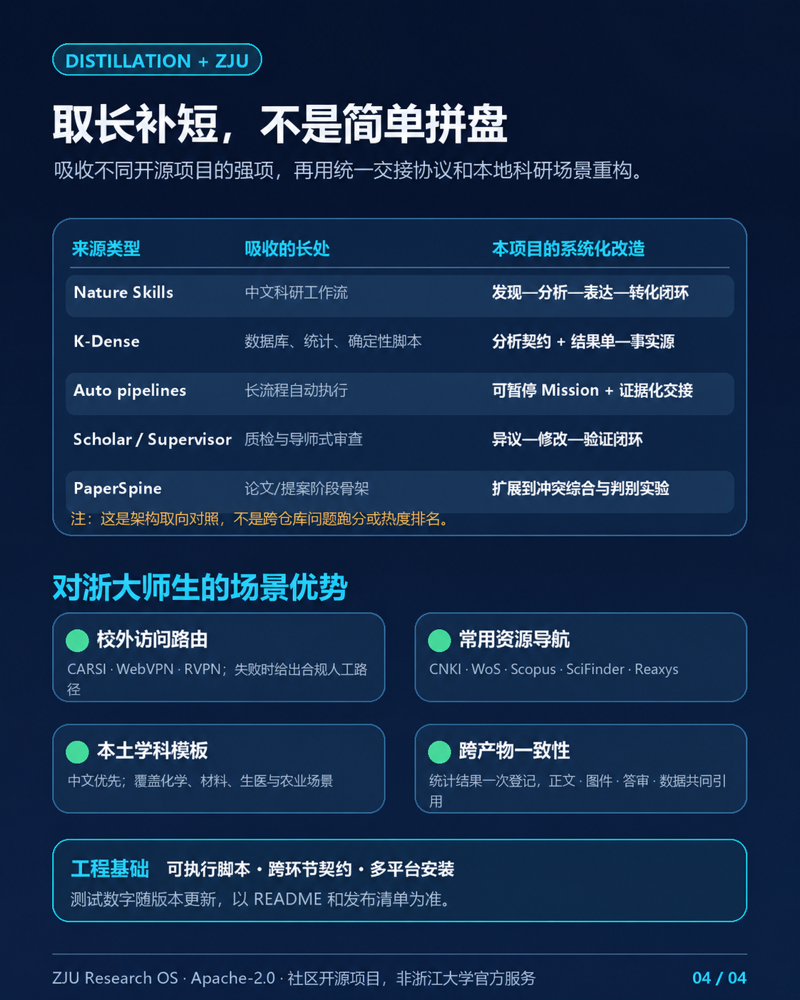

# ZJU Research OS

[](https://github.com/yimuEwood/zju-research-skills/actions/workflows/ci.yml)
[](https://github.com/yimuEwood/zju-research-skills/releases)

这套 Skills 想做的事很直接：用 1 个 Research Director 和 19 个专业 Skill，把检索、阅读、实验记录、统计、写作和投稿串成一条可以交接、也可以追溯的工作流。

项目对浙江大学的数据库访问和常见学科做了适配，但它是社区开源项目，与浙江大学官方无关。


## 为什么要做这一套 Skills

单独搜几篇论文或润色一段文字并不难，真正容易出问题的是长流程。

比如，检索阶段找到的论文到了写作时已经无法对应具体主张；实验记录里写了三个“重复”，统计时却分不清是技术重复还是独立样本；同一个结果被手工复制到正文、图注和答审信后，数字又悄悄变得不一致。

这个项目用一组简单的交接约定来减少这些问题：

- 文献、主张、实验、分析结果和最终文件都有稳定 ID；
- 统计结果先进入 Result Registry，再由正文、图件和答审共同引用；
- 任务可以暂停和恢复，失败实验、冲突证据和未解决问题会保留下来；
- Research Director 负责安排先后顺序，专业 Skill 只处理自己擅长的部分；
- 涉及账号、伦理、专利、外部上传和正式提交时，仍由有权限的人确认。


## 能做什么

| 环节 | 主要 Skills | 典型产物 |
|---|---|---|
| 找文献 | `zju-literature-search`、`zju-literature-monitor`、`zju-fulltext-access` | 检索计划（Search Map）、去重文献集、全文来源包 |
| 核对与阅读 | `zju-reference-audit`、`zju-paper-reader` | 字段差异表、引用支撑检查、论文卡片（Paper Card）、Paper Spine |
| 综合与设计 | `zju-evidence-synthesis`、`zju-hypothesis-design` | 证据表、冲突矩阵、竞争假设、判别实验 |
| 实验与分析 | `zju-experiment-log`、`zju-statistics-audit` | 可追溯实验日志、分析契约（Analysis Contract）、结果注册表（Result Registry） |
| 写作与交流 | `zju-scientific-writing`、`zju-scientific-figure`、`zju-paper2ppt` | 论文草稿、图件、DOCX、PPTX |
| 审稿与交付 | `zju-reviewer`、`zju-review-response`、`zju-data-availability` | 预审报告、逐点答审、数据发布清单 |
| 立项与转化 | `zju-proposal-writer`、`zju-paper-to-patent` | 研究计划、工作包、专利披露图谱 |
| 专业与规范 | `zju-chemistry-databases`、`zju-research-integrity` | 条件对齐的数据表、科研规范审计 |

完整目录见 [`skills/`](skills/)。如果任务横跨多个环节，可以从 [`zju-research-director`](skills/zju-research-director/) 开始。

## 不只是提示词

项目仍然以 Skill 工作流为主，但几条常用链已经有了可以重复运行的执行器：

- 文献：可查询 Crossref、OpenAlex、Europe PMC 和 PubMed，并保留检索参数、分页和来源记录；
- 全文：可获取合法开放的 Europe PMC JATS 全文，不保存账号，也不绕过付费墙；
- PDF：按页提取正文、版面块、章节和图表/公式线索，并生成可回指的页面锚点；
- 数据与统计：可读取常见表格、生成 EDA 概览，并执行一组边界明确的统计模型；
- 图件：从源数据和 `result_id` 生成 PNG、SVG、PDF，同时记录输入与文件哈希；
- 文档：可从已核验的内容生成 DOCX 和 PPTX，并重新打开 OOXML 文件做结构检查。

这些执行器有意保持窄范围。当前统计核心不打算冒充通用统计软件：混合模型、聚类设计、生存分析、多预测量 GLM 和复杂重复测量仍需要专门工具与人工复核。

## 安装

仓库可以直接作为项目级插件使用。也可以把 Skills 安装到 Codex、Claude Code 或 OpenCode 的用户目录。

Windows：

```powershell
.\install.ps1 -Agent all -WithRuntime
```

macOS / Linux：

```bash
sh install.sh --agent all --with-runtime
```

检查安装：

```powershell
python tools/zju_skills.py doctor --agent all
```

更新当前安装：

```powershell
.\update.ps1 -Agent all -Pull -WithRuntime
```

`-Pull` 只会在 Git 工作区干净时执行 `git pull --ff-only`。安装器只管理自己登记的 `zju-*` 目录；替换前会备份，卸载时也会先移动到可恢复目录。

## 两种用法

跨阶段任务适合用完整 Mission：

```text
请使用 zju-research-director，把“钙钛矿器件湿热稳定性”规划成一项 Research Mission。
先完成可复现检索、证据综合和可证伪假设，只执行下一个就绪阶段，不做外部提交。
```

只做一件事时，直接调用专业 Skill 更省事：

```text
请使用 zju-reference-audit，逐字段核验这 30 条参考文献，并分开判断
“书目信息是否正确”和“文献是否支持正文主张”。
```

也可以让 Director 使用 Fast Mode。它只选择一个专业 Skill，不创建完整任务状态；一旦任务需要第二个环节、长期恢复或人工审批，就会建议切换到完整 Mission。

```text
请使用 zju-research-director 的 Fast Mode，把这份 RIS 文献导出规范化并去重；
不要创建完整 Mission。
```

## 可选领域包

组学、材料计算和药物发现没有默认塞进核心 20 项，需要时再装：

```powershell
.\install.ps1 -Agent codex -Pack omics,materials,drug-discovery
```

- `omics`：检查原始计数与样本表，计算 library-size QC、确定性 PCA 和探索性两组筛选。复杂设计仍应使用 DESeq2、edgeR、limma 或单细胞工作流。
- `materials`：检查晶格、体积、组成、密度和周期距离；安装 pymatgen 后可读取 CIF/POSCAR。几何检查不代表材料稳定性。
- `drug-discovery`：整理有来源 ID 的靶点、化合物、活性、选择性、安全性和转化证据，并报告缺失信息与排名敏感性。结果只用于早期决策支持。

领域包位于 [`packs/`](packs/)，不会改变核心 20 项的默认行为。

## 浙大用户可以少做哪些配置

- 全文获取会在开放获取、WebVPN、CARSI、RVPN 和人工馆员路径之间给出合规建议；
- 会提示 CNKI、Web of Science、Scopus、SciFinder、Reaxys 等候选资源，但实际权限以图书馆页面为准；
- 中文问题可以直接进入检索、阅读、统计和写作流程；
- 内置化学、材料、生医、农业和通用计算研究模板；
- 不保存统一身份认证密码、Cookie 或 Token，也不尝试绕过数据库权限。

校内规则入口：[校外访问](https://libweb.zju.edu.cn/56334/list.htm) · [电子资源使用管理办法](https://libweb.zju.edu.cn/2016/1014/c55987a2245977/page.htm) · [学术道德行为规范及管理办法](https://pi.zju.edu.cn/2019/0920/c66998a2550400/page.htm)

## 测试情况

这里把“软件是否按约定工作”和“科研回答是否更好”分开记录。

最新正式版本是 **v1.1.0**。软件包和公开接口已经进入稳定发行线，但科研能力评测仍是 **Beta**，`official_portfolio_score` 仍为 `null`。这两个状态不是一回事。

### 已经确认的基础结果

- 20 个核心 Skills 全部通过格式与资源检查；
- 基础契约检查为 **120/120**，输入清单绑定 **178** 个输入文件；
- 20 个 Skills 的确定性功能测试为 **400/400**：每项 20 例，共覆盖 100 个核心能力，每项都含 5 个反例；
- v1.1.0 发布快照发现 **296** 项离线测试；本地带可选缓存时 296/296 通过，干净检出必须通过 295 项，另有 1 项缓存检查可明确跳过；
- 核心与可选领域包合计扫描 **68** 个 Python 执行脚本，按当前静态规则未发现问题；
- 分支 CI 覆盖 Ubuntu / Windows 和 Python 3.11 / 3.13。

这些数字说明脚本能按固定输入得到预期结果，也能在错误输入上按约定拒绝；它们不等于科研结论有 100% 正确率。可复算的 L2 报告见 [`docs/evaluation/l2-deterministic-report-v3.md`](docs/evaluation/l2-deterministic-report-v3.md)。

### 早期内部测试（不是第三方测评）

2026-08-11，我们曾用 70 道内部测试题比较三种设置：不使用 Skill、使用固定版本的 Nature 上游，以及使用 ZJU 版本，共得到 210 份回答。评分时隐藏了设置名称，由同一评分模型独立评两次，分歧时再评一次。它不是第三方或独立人类测评。

| 评测臂 | 平均内部质量分 | 中位耗时 | 中位 Token | 关键失败 |
|---|---:|---:|---:|---:|
| 无 Skill | 56.759 | 31.377 秒 | 34,091 | 3/70 |
| 固定 Nature 上游 | 61.714 | 61.924 秒 | 96,989 | 4/70 |
| ZJU 版本 | **85.205** | **57.224 秒** | **72,893.5** | **0/70** |

这组数据只能用来判断早期开发方向：ZJU 版本比固定 Nature 上游高 23.491 分，中位耗时低 7.59%，Token 中位数低 24.84%。其中 7 道题参加过前期 pilot，三种设置的位置和工具条件也没有完全锁定，而且完整逐条记录尚未公开。因此它不能外推到全部 20 项，也不能当成准确率或正式 benchmark。

<details>
<summary>查看首批 7 项的分项结果</summary>

| Skill | 相对“无 Skill / 上游中较高者”的内部分差 | 当时的通过方式 |
|---|---:|---|
| Literature Search | +26.063 | 质量 |
| Full-text Access | +22.187 | 质量 |
| Reference Audit | +30.124 | 质量；耗时下降 16.809%，Token 下降 41.991% |
| Paper Reader | +9.938 | 效率；耗时下降 26.958%，Token 下降 33.950% |
| Experiment Log | +24.437 | 质量 |
| Statistics Audit | +10.687 | 质量 |
| Scientific Writing | +28.125 | 质量 |

</details>

12 个扩展 Skills 还跑过 120 道开发测试题，平均内部得分 84.385/100，预设检查项命中率 84.58%，严重失败为 0。由于没有同时比较“不使用 Skill”和开源基线，这组数据同样只用于开发回归。

### 尚待完成：外部盲测

剩下的 L3/L4 不能由项目作者自己“补数据”。计划中的 L3 是每个 Skill 12 道已知任务、三种设置共 720 份回答；L4 是每项 15 道由外部人员保管的未见任务，共 900 份回答。两层都要提前固定开源基线，平衡三种设置，并由两名独立评分者评分；L4 还要保留首次作答记录和外部管理员签名。少一项，正式分数都会保持为空。

如果你愿意参与独立测试，可以先看 [`外部盲测手册`](docs/evaluation/external-blind-evaluation-v3.md)，再通过 [独立评测报名表](https://github.com/yimuEwood/zju-research-skills/issues/new?template=independent-evaluator.yml) 选择角色。协议和当前状态见 [`evals/portfolio-protocol-v3.md`](evals/portfolio-protocol-v3.md)、[`evals/skill-evaluation-matrix-v3.json`](evals/skill-evaluation-matrix-v3.json) 和 [`provenance/evaluation-status-v3.yaml`](provenance/evaluation-status-v3.yaml)。

## 和其他科研 Skills 的关系

这个项目以 [Nature Skills](https://github.com/Yuan1z0825/nature-skills) 为中文工作流骨架，也参考了 [K-Dense Scientific Agent Skills](https://github.com/K-Dense-AI/scientific-agent-skills)、[PaperSpine](https://github.com/WUBING2023/PaperSpine)、[Claude Scholar](https://github.com/Galaxy-Dawn/claude-scholar) 和 [Auto-claude-code-research-in-sleep](https://github.com/wanshuiyin/Auto-claude-code-research-in-sleep) 的一些做法。

本项目更强调跨环节交接、稳定 ID、结果一致性、中文场景和可验证脚本；它的短板也很明确：无人值守实验、长期研究记忆、垂直写作体验和第三方独立能力证据都还不够成熟。除了首批 7 项与固定 Nature 上游做过早期内部对照，其他项目没有同题 head-to-head 测试，所以这里不做“谁最强”的排名。

来源 URL、固定 commit、许可证和采用范围记录在 [`provenance/sources.yaml`](provenance/sources.yaml) 与 [`NOTICE`](NOTICE) 中。



## 项目结构

```text
skills/       20 个核心 Skills
packs/        可选领域包
evals/        案例、协议、评分器与证据模板
tests/        离线测试和真实产物测试
provenance/   来源、版本和发布状态
tools/        安装、更新与诊断工具
```

项目代码和原创工作流按 [Apache-2.0](LICENSE) 发布，第三方归属见 [`NOTICE`](NOTICE)。非商业或 Share-Alike 来源只用于比较，没有把其受限内容并入当前发行包。

如果你在真实课题里遇到失败案例，欢迎提交一个可以复现的最小样本。对这个项目来说，失败样本通常比一句“很好用”更有价值。
